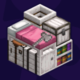

#  
&emsp;&emsp;&emsp; More Variants: Pale Oak Backport  <a title="More Variants: Pale Oak Backport on Curseforge" href="https://www.curseforge.com/minecraft/mc-mods/more-variants-pale-oak-backport"></a> 

>   
>  An Add-on mod adding Pale Oak Variants to More X Variants mods in versions <code>1.20.1</code> and <code>1.21(.1)</code>.    
>    
>    
>  

<h5>Show in-game example image</h5>
  

 

###  Compatibility

<table>
  <thead>
    <tr>
      <td><strong>Minecraft</strong></td>
      <td>
        <a href="https://modrinth.com/mod/more-variants-pale-oak-backport/versions?g=1.20.1"><code>1.20.1</code></a> 
        <a href="https://modrinth.com/mod/more-variants-pale-oak-backport/versions?g=1.21&g=1.21.1"><code>1.21(.1)</code></a>
      </td>
    </tr>
  </thead>
  <tbody>
    <tr>
      <td><strong>Mod Loaders</strong></td>
      <td><a href="https://fabricmc.net/use/installer/"><code>Fabric Loader</code></a></td>
    </tr>
  </tbody>
  <thead>
    <tr>
      <td><strong>Requires</strong></td>
      <td>
        <a href="https://modrinth.com/mod/fabric-api"><code>Fabric API</code></a> 
<a href="https://modrinth.com/mod/more-variants-core"><code>More Variants Core</code></a>
      </td>
    </tr>
  </thead>
  <tbody>
    <tr>
      <td><strong>More Variants for</strong></td>
      <td>
<a href="https://modrinth.com/mod/more-barrel-variants"><code>More Barrel Variants</code></a> 
<a href="https://modrinth.com/mod/more-bed-variants"><code>More Bed Variants</code></a> 
<a href="https://modrinth.com/mod/more-beehive-variants"><code>More Beehive Variants</code></a> 
<a href="https://modrinth.com/mod/more-bookshelf-variants-lieonlion"><code>More Bookshelf Variants</code></a> 
<a href="https://modrinth.com/mod/more-cartography-tables"><code>More Cartography Tables</code></a> 
<a href="https://modrinth.com/mod/more-chest-variants-lieonlion"><code>More Chest Variants</code></a> 
<a href="https://modrinth.com/mod/more-chiseled-bookshelf-variants"><code>More Chiseled Bookshelf Variants</code></a> 
<a href="https://modrinth.com/mod/more-composter-variants"><code>More Composter Variants</code></a> 
<a href="https://modrinth.com/mod/more-crafter-variants"><code>More Crafter Variants</code></a> 
<a href="https://modrinth.com/mod/more-crafting-tables-lieonlion"><code>More Crafting Tables</code></a> 
<a href="https://modrinth.com/mod/more-fletching-tables"><code>More Fletching Tables</code></a> 
<a href="https://modrinth.com/mod/more-grindstone-variants"><code>More Grindstone Variants</code></a> 
<a href="https://modrinth.com/mod/more-jukebox-noteblock-variants"><code>More Jukebox/Noteblock Variants</code></a> 
<a href="https://modrinth.com/mod/more-lectern-variants"><code>More Lectern Variants</code></a> 
<a href="https://modrinth.com/mod/more-loom-variants"><code>More Loom Variants</code></a> 
<a href="https://modrinth.com/mod/more-shield-variants"><code>More Shield Variants</code></a> 
<a href="https://modrinth.com/mod/more-smithing-tables"><code>More Smithing Tables</code></a> 
<a href="https://modrinth.com/mod/more-smoker-variants"><code>More Smoker Variants</code></a> 
<a href="https://modrinth.com/mod/more-nemos-woodcutter-variants"><code>More Nemo's Woodcutter Variants</code></a> 
<a href="https://modrinth.com/mod/nemos-campfires"><code>Nemo's Campfires</code></a> 
<a href="https://modrinth.com/mod/more-stick-variants"><code>More Stick Variants</code></a> 
<a href="https://modrinth.com/mod/more-armor-stand-variants"><code>More Armor Stand Variants</code></a> 
<a href="https://modrinth.com/mod/more-fishing-rod-variants"><code>More (Fishing) Rod Variants</code></a> 
<a href="https://modrinth.com/mod/more-frame-variants"><code>More (Item/Painting) Frame Variants</code></a> 
<a href="https://modrinth.com/mod/more-rail-variants"><code>More Rail Variants</code></a> 
<a href="https://modrinth.com/mod/more-tool-variants"><code>More Tool Variants</code></a> 
<a href="https://modrinth.com/mod/more-torch-variants"><code>More Torch Variants</code></a> 
<a href="https://modrinth.com/mod/more-weapon-variants"><code>More Weapon Variants</code></a> 
<a href="https://modrinth.com/mod/nemos-more-ladder-variants"><code>Nemo's More Ladder Variants</code></a> 
      </td>
    </tr>
  </tbody>
</table>
 

###  Translations

> [!NOTE]
> > Due to the fact that this mod backports existing content from mods, translations will be taken from the original mods.  
> > So if you want to help with translations, please consider contributing to the original mods.

 

  

### Versions

<!--CHANGELOG:START-->

#### 1.0.0[*](#footnote-*):
- Initial release

<h2><ins>Download 1.0.0 + 1.20.1</ins>:&#x200A;
&#x200A;

</h2>

<!--CHANGELOG:END-->

> <strong>*</strong>: Most recent version  
> _`The version above is automatically updated with the newest release and only after it has been successfully published.`_

> [!TIP]
> > Looking for changes of previous versions?  
> > You can find them in the [changelog history](./CHANGELOG_history.md).

---
#### Support/Contact
- Suggestions? Questions? Bug reports?  
  Feel free to [open an issue](/../../issues)!  
  &nbsp;  
  You can also contact me via email at [contact@pnku.de](mailto:contact@pnku.de) or join the [Discord](https://dsc.lieonlion.dev) and contact me there.